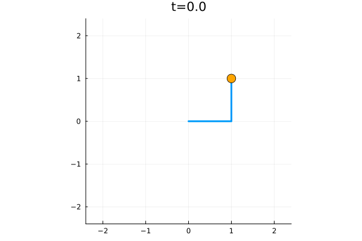

# Pendulums.jl

A Julia simulation and visualization project for single and double pendulums, illustrating their classical and chaotic dynamics.



---

## 🔍 Overview

This repository provides a collection of numerical simulations and animations for:

- Simple pendulum (undamped and damped)
- Forced oscillation and resonance
- Double pendulum in chaotic and linear regimes
- Comparison between numerical and analytical solutions (normal modes)

The core solvers are implemented from scratch, including a 4th order Runge-Kutta and a symplectic (Verlet) integrator.

---

## 📁 Project Structure

```
Pendulums.jl/
├── src/
│   ├── ODESolvers.jl           # Runge-Kutta and symplectic integrator
│   ├── Pendulum.jl             # Dynamics of single and double pendulums
│   ├── examples1.jl            # Basic single pendulum animation
│   ├── examples2.jl            # Damping and forced oscillation analysis
│   ├── examples3.jl            # Double pendulum and chaos visualization
│   ├── examples4.jl            # Comparison: numerical vs analytical solution
├── images/                    # GIFs and figures
└── README.md                  # This file
```

---

## 📽 Features & Demos

- 🎞 GIF animations with Plots.jl
- 🎯 Custom integrator framework with method dispatch
- 🌀 Chaotic trajectory tracing for the double pendulum
- 🔍 Phase space & FFT spectrum for harmonic analysis
- 📊 Analytical comparison of small-angle normal modes

---

## 🚀 Getting Started

```julia
using Pkg
Pkg.add("Plots")
Pkg.add("FFMPEG")  # For GIF generation

include("ODESolvers.jl")
include("Pendulum.jl")
include("examples1.jl")  # or any other example
```

---

## 📚 Physics Concepts Illustrated

- Harmonic motion
- Energy dissipation and resonance
- Nonlinear dynamics and chaos
- Hamiltonian systems and symplectic integration
- Normal mode analysis

---

## 🧠 Educational Value

This project is ideal for:

- Students learning classical mechanics
- Demonstrations of deterministic chaos
- Exploring structure-preserving numerical methods
- Visual comparison between linearized and nonlinear dynamics

---

## 📦 Future Plans

- [ ] Energy plots and conservation tests
- [ ] Pluto.jl interactive sliders for real-time parameter tuning
- [ ] Machine learning regression of trajectories
- [ ] Extend to triple pendulum or coupled oscillator chains

---

## 📄 License

MIT License © 2025 Hiromu Ushihara
